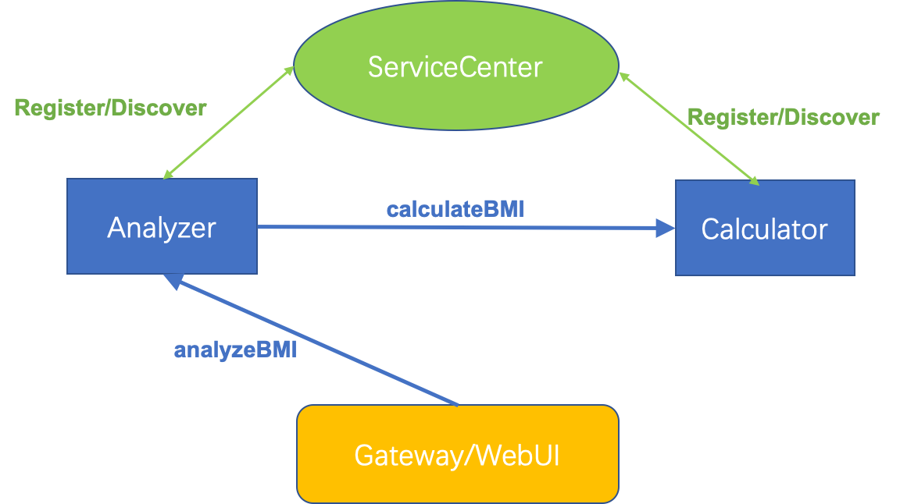
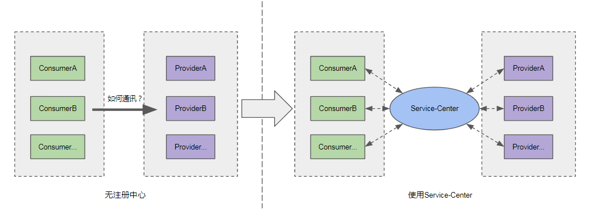

## 介绍
本指南将以一个简单的 体质指数(BMI) 计算应用开启你的微服务之旅，本应用仅提供根据用户输入的身高和体重数据计算BMI体质指数的这一个简单功能，但会向你展示构建一个基本的微服务应用所需要的全部组件组件和关键技术，
并将向你如何利用ServiceComb-tookit工具快速生成微服务的脚手架，加速应用开发。
该应用包含以下4个进程：
+ 服务注册中心 (ServiceCenter): 负责服务的注册和发现。后续将说明该概念。
+ BMI计算微服务 (Caculator) : 提供BMI计算API。
+ BMI解读微服务 (Analyzer): 调用的BMI计算微服务的,对返回的BMI指数进行解读，判断该BMI指数代表的健康情况。和BMI指数一起形成更完整的数据。向你展示微服务之间的调用技术。
+ 体质指数网关/前端界面 (Gateway): 提供用户界面及网关服务。后续也会解释网关的概念和作用。

应用的架构图为:




## 安装环境

+ 安装git，详情可参考 [git安装教程](https://git-scm.com/book/zh/v2/%E8%B5%B7%E6%AD%A5-%E5%AE%89%E8%A3%85-Git)。

+ 安装JDK 1.8，详情可参考 [JDK安装教程](https://git-scm.com/book/zh/v2/%E8%B5%B7%E6%AD%A5-%E5%AE%89%E8%A3%85-Git)。

+ 安装Maven 3.x，详情可参考 [Maven安装教程](https://maven.apache.org/install.html) 。

+ 下载BMI-Sample的源代码，其中包含前端界面和ServiceComb-Toolkit工具，其中，前端界面的代码已为你准备好，其他的部分则需要您使用ServiceComb-Toolkit工具，自己开发。
```shell script
  git clone https://github.com/apache/servicecomb-samples.git
  cd servicecomb-samples
```

## 步骤1: 微服务拆分设计，使用ServiceComb-Tookit工具生成微服务脚手架
开发微服务第1歩是，把应用拆分成多个微服务，并明确每个微服务的接口（API)。
体质计算 应用包含2个接口，分别由2个微服务提供。
+ BMI计算微服务: `public double calculateBMI(double height, double weight);`
+ BMI解读微服务: `public BMIViewObject analyzeBMI(double height, double weight);`
编辑这2个接口的契约文件，契约文件详细的描述的接口的输入输出    

BMI计算微服务契约： contract/calculator/CalculatorRestEndpoint.yaml
```yaml
openapi: 3.0.2
info:
  title: gen
  version: 1.0.0
servers:
- url: http://127.0.0.1
paths:
  /calculateBMI:
    get:
      operationId: calculateBMI
      parameters:
      - name: height
        in: query
        schema:
          type: number
          format: double
        required: true
      - name: weight
        in: query
        schema:
          type: number
          format: double
        required: true
      responses:
        200:
          description: OK
          content:
            application/json:
              schema:
                type: number
                format: double
```


BMI解读微服务契约： contract/analyzer/AnalyzeRestEndpoint.yaml
```yaml
openapi: 3.0.2
info:
  title: gen
  version: 1.0.0
servers:
- url: http://127.0.0.1
paths:
  /analyzeBMI:
    get:
      operationId: analyzeBMI
      parameters:
      - name: height
        in: query
        schema:
          type: number
          format: double
        required: true
      - name: weight
        in: query
        schema:
          type: number
          format: double
        required: true
      responses:
        200:
          description: OK
          content:
            application/json:
              schema:
                $ref: '#/components/schemas/BMIViewObject'
components:
  schemas:
    BMIViewObject:
      type: object
      properties:
        result:
          type: number
          format: double
        instanceId:
          type: string
        callTime:
          type: string
        analyzeResult:
          type: string
```


使用ServiceComb-Toolkit生成脚手架
```shell script
java -jar cli-0.2.0.jar codegenerate -i contract/calculator/CalculatorRestEndpoint.yaml -o target -t provider --group-id com.demo --artifact-id calculator
java -jar cli-0.2.0.jar codegenerate -i contract/analyzer/AnalyzeRestEndpoint.yaml -o target -t provider --group-id com.demo --artifact-id analyzer
```

## 步骤2: 实现这2个微服务

calculator微服务业务代码 calculator-code.txt
```java
//导包
import java.math.BigDecimal;
import java.math.RoundingMode;


//接口方法内部业务代码
if (height <= 0 || weight <= 0) {
  throw new IllegalArgumentException("Arguments must be above 0");
}

double heightInMeter = height / 100;
double bmi = weight / (heightInMeter * heightInMeter);
double bmiResult = BigDecimal.valueOf(bmi).setScale(1, RoundingMode.HALF_UP).doubleValue();

return new ResponseEntity<Double>(bmiResult, HttpStatus.OK);
```

analyzer微服务业务代码 analyzer-code.txt
```java
//导包
import org.apache.servicecomb.provider.springmvc.reference.RestTemplateBuilder;
import org.apache.servicecomb.serviceregistry.RegistryUtils;
import org.apache.servicecomb.serviceregistry.api.registry.MicroserviceInstance;
import java.text.SimpleDateFormat;
import java.util.Date;
import java.util.HashMap;
import org.springframework.web.client.RestTemplate;

//成员变量
private static RestTemplate restTemplate = RestTemplateBuilder.create();

//接口方法内部业务代码
if (height <= 0 || weight <= 0) {
  throw new IllegalArgumentException("Arguments must be above 0");
}

Map<String,Object> paramMap = new HashMap<String, Object>() {{
  put("height",height);
  put("weight",weight);
}};

Double bmiResult = restTemplate.getForObject(
        "cse://calculator/calculateBMI?height={height}&weight={weight}",
        Double.class,
        paramMap);

String analyzeResult = "";
if (bmiResult >= 18.5 && bmiResult <= 24.9) {
  analyzeResult = "healthy";
} else {
  analyzeResult = "unhealthy";
}

BMIViewObject result = new BMIViewObject();
result.setResult(bmiResult);
result.setAnalyzeResult(analyzeResult);

result.setCallTime(new SimpleDateFormat("HH:mm:ss").format(new Date()));
result.setInstanceId(RegistryUtils.getMicroserviceInstance().getInstanceId());

return new ResponseEntity<BMIViewObject>(result, HttpStatus.OK);
```


* 运行calculator微服务
```shell script
# 将监听地址改为9090，防止端口冲突
vim target/calculator/src/main/resources/microservice.yaml

cd target/calculator
mvn spring-boot:run
```

打开浏览器通过访问`http://127.0.0.1:8080/calculateBMI?height=180&weight=20`检验该微服务，会返回BMI数值，证明该微服务运行成功。

* 运行analyzer微服务
```shell script
# 将监听地址改为9090，防止端口冲突
vim target/calculator/src/main/resources/microservice.yaml

cd target/analyzer
mvn spring-boot:run
```
打开浏览器通过访问`http://127.0.0.1:9090/analyzeBMI?height=180&weight=20` 检验该微服务，因为analyzer依赖calculator，目前没有运行服务中心，所以analyzer无法发现calculator。所以目前调用会失败。


## 步骤3: 运行服务中心，运行网关。
### 运行服务中心
```
./start-service-center.sh
```
### 服务中心的服务注册和发现功能的解读


在无注册中心的时候，每个服务的调用者(Consumer)，在调用服务提供者(provider)时，需要了解服务提供者的具体的物理地址（IP+端口），这个在有大量的微服务，每个微服务有大量的实例的时候，并不现实。
当使用服务中心后，每个微服务均向服务中心注册自己，所以只需要利用服务名就可以定位到某一个微服务的某个具体实例。所以在analyser微服务中的代码，现在能够工作了。

测试:

### 运行网关
```
cd gateway
mvn spring-boot:run
```

### 网关功能解读
微服务之间的调用，可以利用服务中心的微服务的注册和发现功能来实现。
但外部的应用（比如前端界面）要调用某个微服务的某个API该如何实现呢？答案是通过网关。网关的主要作用是路由:
在我们的例子中，网关的物理地址是 127.0.0.1:80, 网关对他的 127.0.0.1:80/analyser/analyseBMI的请求 转化为对
caculator 的请求 127.0.0.1:8000/analyseBMI
其转化的公式为
> 网关的IP:端口/服务A的服务名/URI = 服务A的IP:端口/URI

因此，外部应用在访问微服务应用的某个接口时，不用再了解该接口所在的实例的具体的地址。


## 步骤4: 恭喜你，你已经开发完了你的第一个微服务应用。
访问前端:
http://localhost:8889

你已经成功完成了Codelab并学到了：
+ 一个简单的微服务需要的基本组件有：注册中心，网关，执行具体业务的微服务
+ 如何利用ServieComb-Toolkit快速开发微服务应用的脚手架。
+ 微服务之间如何相互调用
+ 注册中心的使用和原理
+ 网关的使用和原理

